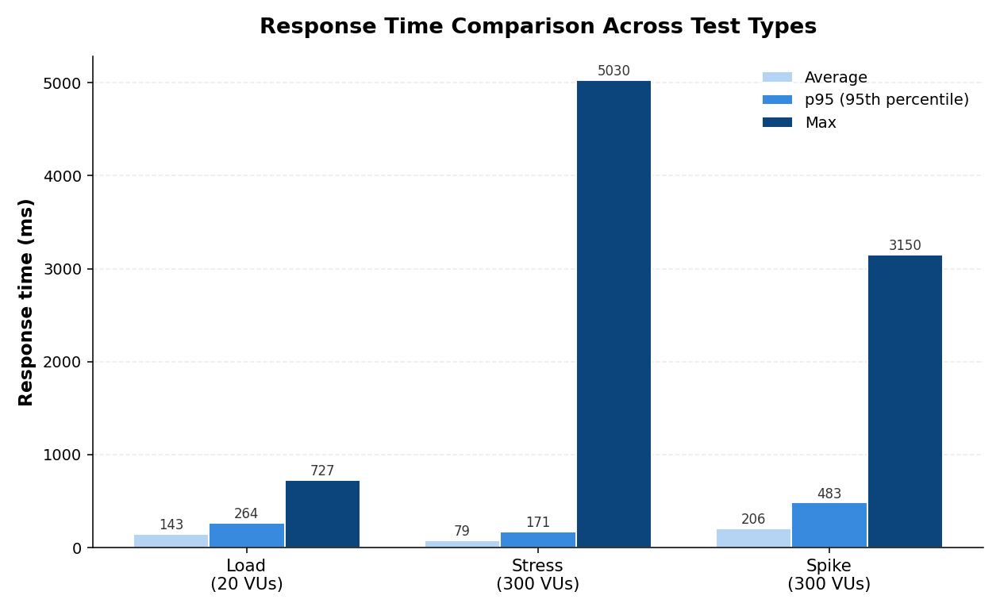
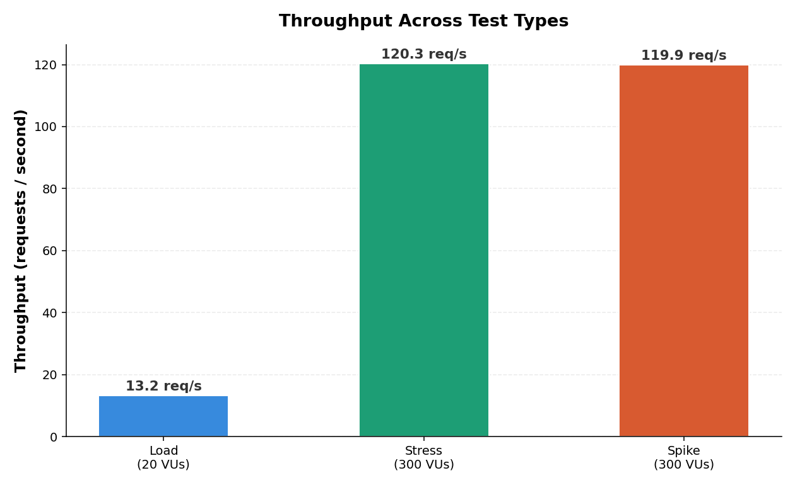

# Comprehensive Performance Testing and Bottleneck Analysis of the JSONPlaceholder REST API Using Grafana k6

| Item | Detail |
|------|--------|
| **Assignment** | ITT440 Individual Assignment (Individual Submission) |
| **Student** | Mariatulkaftiah binti Othman |
| **Target API** | `https://jsonplaceholder.typicode.com/posts` |
| **Primary Tool** | Grafana k6 (JavaScript scripts) |
| **Tests Performed** | Load Test, Stress Test, Spike Test |
| **Operating System** | Windows 11 |

---

## Results at a Glance

Here is a quick summary of what I found. The full details are further down in the [Results & Analysis](#results--analysis) section.

| Test | What it checks | p95 Response Time | Throughput | Errors | Result |
|------|----------------|:-----------------:|:----------:|:------:|:------:|
| **Load** | Normal traffic (20 users) | 264 ms | 13 req/s | 0% | ✅ Pass |
| **Stress** | Heavy traffic (300 users) | 171 ms | 120 req/s | 0% | ✅ Pass |
| **Spike** | Sudden burst (10 → 300) | 483 ms | 120 req/s | 0% | ✅ Pass |

**Main finding:** The API was very strong, it handled 300 users with zero failures. The only weakness was a few very slow requests (tail latency), where the slowest reached about 5 seconds even though most were under half a second.

---

## Table of Contents
1. [How It Works](#how-it-works)
2. [Problem Statement](#problem-statement)
3. [System Requirements](#system-requirements)
4. [Installation](#installation)
5. [How to Run](#how-to-run)
6. [Project Structure](#project-structure)
7. [Test Types](#test-types)
8. [Metrics Explained](#metrics-explained)
9. [Sample Output](#sample-output)
10. [k6 Test Scripts](#k6-test-scripts)
11. [Results & Analysis](#results--analysis)
12. [Bottlenecks & Recommendations](#bottlenecks--recommendations)
13. [Conclusion](#conclusion)
14. [Demo Video](#demo-video)

---

## How It Works

```
Maelicious88's PC  ──────────────────────────►  jsonplaceholder.typicode.com
                    sends HTTP GET/POST requests       (public API server)
                    using Grafana k6                          │
Maelicious88's PC  ◄──────────────────────────  returns JSON response
                    measures response time,
                    throughput and error rate
```

- **Maelicious88's PC** is the **client**, it runs k6 and sends the requests
- `jsonplaceholder.typicode.com` is the **server**, it responds with JSON data
- The **internet** is the bridge between them
- That's why latency varies every run, it depends on real network conditions at that moment

---

## Problem Statement

Modern APIs must handle varying traffic patterns, from steady sustained load to sudden spikes. Identifying **where and when** performance degrades is critical for building reliable systems.

This project investigates the performance characteristics of a public REST API (`jsonplaceholder.typicode.com/posts`) under three traffic profiles:

| Test Type | Description |
|-----------|-------------|
| **Load Test** | Simulate normal, sustained traffic (20 virtual users) |
| **Stress Test** | Exceed normal capacity to find breaking points (up to 300 virtual users) |
| **Spike Test** | Simulate a sudden traffic burst (jump from 10 to 300 virtual users) |

Instead of comparing programming techniques, this project focuses on the API itself, how the same `/posts` endpoint behaves when the traffic pattern changes, and where its real weak points are.

---

## System Requirements

Below are the minimum things you need to run this project on your own computer. You do not need a powerful machine, any normal laptop works.

| Component | Minimum | Why it is needed |
|-----------|---------|------------------|
| Grafana k6 | v2.0.0 or newer | This is the testing tool that sends the traffic and measures the results. |
| RAM | 512 MB | k6 is very light, so even an old laptop can run it. More RAM helps when simulating many users. |
| Operating System | Windows 10 / macOS 12 / Ubuntu 20.04 (or newer) | k6 works on all three. I used Windows 11. |
| Internet connection | Required | The tests send real requests to the live API online, so you must be connected to the internet. |

In short: install k6, make sure you have an internet connection, and you are ready to run the tests on almost any computer.

---

## Installation

### Step 1 – Install k6 (Windows)

```bash
winget install k6 --source winget
```

### Step 2 – Check it works

```bash
k6 version
```

This printed `k6.exe v2.0.0` on my machine, confirming it was ready.

---

## How to Run

Run each test from PowerShell in the folder with the scripts:

```bash
# Load Test
k6 run load-test.js

# Stress Test
k6 run stress-test.js

# Spike Test
k6 run spike-test.js
```

Each run prints a live progress bar and a full summary table of results at the end.

---

## Project Structure

```
MARIATULKAFTIAH BINTI OTHMAN/
│
├── README.md                       # This article
├── load-test.js                    # Load test script (20 VUs)
├── stress-test.js                  # Stress test script (up to 300 VUs)
├── spike-test.js                   # Spike test script (sudden burst)
├── response-time-comparison.png    # Chart: response times
├── throughput.png                  # Chart: throughput
└── error-rate.png                  # Chart: error rate
```

---

## Test Types

### Load Test (20 virtual users)
Ramps up to 20 virtual users, holds for one minute, then ramps down. This simulates normal, everyday traffic. Each user reads the posts list (`GET`) and sometimes creates a post (`POST`), with a 1-second pause to act like a real person.

### Stress Test (up to 300 virtual users)
Climbs in steps, 50, 100, 200, then 300 virtual users, holding each step for one minute, then drops back to zero. This pushes the API beyond normal levels to find the breaking point and check if it recovers.

### Spike Test (sudden burst to 300)
Holds a calm baseline of 10 users, jumps to 300 in just 10 seconds, holds the spike for a minute, then drops back down. This tests whether the API survives a sudden rush and how fast it recovers.

---

## Metrics Explained

| Metric | Meaning |
|--------|---------|
| `http_req_duration` | How long a request takes (read as p95, the 95th percentile) |
| `http_req_failed` | Percentage of requests that failed at the HTTP level |
| `http_reqs` | Total requests, and requests per second (throughput) |
| `vus` | Number of active virtual users (the load level) |
| p95 | 95% of requests were faster than this value |

I report **p95** instead of just the average, because the average can hide a few very slow requests. The p95 and the maximum show where real users feel the pain.

---

## Sample Output

> Tests run on Windows 11 using k6 v2.0.0 against the live `/posts` endpoint.

### Performance Comparison Summary (Actual Results)

| Test Type | Avg Latency | p95 Latency | Max Latency | Throughput | Error Rate |
|-----------|:-----------:|:-----------:|:-----------:|:----------:|:----------:|
| load      |   143.06 ms |   264.63 ms |   727.33 ms |  13.22 /s  |    0.00%   |
| stress    |    79.90 ms |   171.14 ms |    5.03 s   | 120.35 /s  |    0.00%   |
| spike     |   206.20 ms |   483.10 ms |    3.15 s   | 119.91 /s  |    0.00%   |

### Key Finding
- **Load test** stayed fast and clean, p95 of only 264 ms with 0% errors
- **Stress test** handled 300 users with the best p95 (171 ms) but had the worst maximum latency (5.03 s)
- **Spike test** survived the sudden burst cleanly with 100% successful checks, p95 of 483 ms

---

## k6 Test Scripts

The three test scripts are written in JavaScript. To use them, you create a plain text file for each one (for example `load-test.js`) and paste in the code below. You can make these files in any text editor like Notepad or VS Code, save them with the `.js` ending, and put them in one folder. Then you run them with the `k6 run` command shown earlier.

All three scripts are also included in this repository, so you can download them directly instead of typing them out.

### Load Test (`load-test.js`)

```javascript
export const options = {
  stages: [
    { duration: '30s', target: 20 },  // ramp up to 20 users
    { duration: '1m',  target: 20 },  // hold at 20 users
    { duration: '30s', target: 0  },  // ramp down
  ],
  thresholds: {
    http_req_duration: ['p(95)<500'],
    http_req_failed:   ['rate<0.01'],
  },
};
```
- Simulates normal traffic with 20 users
- Each user reads posts and sometimes creates one

### Stress Test (`stress-test.js`)

```javascript
export const options = {
  stages: [
    { duration: '1m', target: 50  },
    { duration: '1m', target: 100 },
    { duration: '1m', target: 200 },
    { duration: '1m', target: 300 },  // push to the breaking point
    { duration: '1m', target: 0   },
  ],
};
```
- Climbs in steps to 300 users to find the limit

### Spike Test (`spike-test.js`)

```javascript
export const options = {
  stages: [
    { duration: '30s', target: 10  },  // baseline
    { duration: '10s', target: 300 },  // sudden spike
    { duration: '1m',  target: 300 },  // hold the spike
    { duration: '10s', target: 10  },  // drop back
    { duration: '30s', target: 10  },  // recovery
  ],
};
```
- Jumps suddenly from 10 to 300 users to test a traffic burst

---

## Results & Analysis

> Tests run on Windows 11 using k6 v2.0.0.

### Summary Table

| Test | Avg (ms) | p95 (ms) | Max | Throughput (req/s) | Errors | Total Requests |
|------|:--------:|:--------:|:---:|:------------------:|:------:|:--------------:|
| Load   | 143.06 | 264.63 | 727 ms | 13.22  | 0% | 1,610  |
| Stress | 79.90  | 171.14 | 5.03 s | 120.35 | 0% | 36,159 |
| Spike  | 206.20 | 483.10 | 3.15 s | 119.91 | 0% | 18,003 |

### Chart 1, Response Time


The average and p95 response times stayed low across all three tests. The load test had a p95 of 264 ms, the stress test was actually the fastest at 171 ms even with 300 users, and the spike test was 483 ms during its sudden burst. But the maximum response time tells a different story, it jumped to 5 seconds in the stress test and 3 seconds in the spike test. So most requests were fast, but a few were very slow. This is called **tail latency** and it is the main bottleneck.

### Chart 2, Throughput


The throughput scaled very well, from about 13 requests/second in the load test up to around 120 in the stress and spike tests. That is roughly 9 times more traffic, and the API never crashed or rejected a request. This shows the API has strong capacity.

### Chart 3, Error Rate


The error rate was almost perfect in all three tests. The load and spike tests had 0% failed checks, and the stress test had only 0.01% (just 4 out of 36,159 requests were a little slow). Importantly, `http_req_failed` was 0% everywhere, the server never actually rejected a single request. The few "failed" checks were only requests that were slightly slower than my target time, not real errors.

### Did My Hypothesis Hold?

My hypothesis was mostly correct, with one interesting point:
- I expected the normal load test to be fast and clean with no errors, this was true (p95 264 ms, 0% errors).
- I expected errors to appear under heavy load, but the API handled 300 users with zero HTTP failures, so it is stronger than I thought.
- My spike prediction was accurate, the burst was survived cleanly and only caused a few slower requests during the surge.

---

## Bottlenecks & Recommendations

**Bottlenecks I found:**
1. **Tail latency**, a few requests took up to 5 seconds even though most were under half a second. This is the main weakness.
2. **No real breaking point**, even at 300 users the API never failed, so its true limit is higher than I tested.
3. **Slight slowness under sudden spikes**, the spike test had a higher p95 (483 ms) than the steady stress test (171 ms), showing that sudden bursts cost a little more than gradual load.

**Recommendations:**
- Use **caching or a CDN** to serve common responses faster and reduce tail latency.
- **Warm up the connection** before measuring, so the first test is not unfairly slow.
- Add **rate limiting** so sudden spikes return controlled responses in a real API.
- Run these k6 tests in a **CI/CD pipeline** to catch performance problems early.

---

## Conclusion

The JSONPlaceholder API was stronger than I expected. It handled 300 users at once with zero failures across more than 55,000 requests in total, and most requests were very fast (often under half a second). The main weakness was tail latency, a small number of requests took up to 5 seconds during heavy load, even though the average and p95 stayed low.

My hypothesis was mostly correct: the normal load was fast and clean, and the spike was survived well. The one surprise was how robust the API was under stress, it never failed even at 300 users, so its real breaking point is higher than I tested.

Overall this project helped me learn how to use a real performance testing tool, how to read metrics like p95 and throughput, and why it is important to look at the maximum and percentiles instead of just the average. The average looked healthy in every test, but the maximum revealed the real weak point. These are useful skills for real software work in the future.

---

## Demo Video

▶️ [Watch on YouTube](PASTE_YOUR_YOUTUBE_LINK_HERE)

The video shows me installing k6, running the three tests, and walking through my most important results.

---

## References & Sources

Here are the official, trusted sources I used for this project so readers can verify the information and learn more:

| Source | What it is | Link |
|--------|-----------|------|
| Grafana k6 | The official website and documentation for the testing tool I used | https://k6.io |
| k6 Documentation | Official guides on writing tests, options, and metrics | https://grafana.com/docs/k6/latest/ |
| k6 on GitHub | The open-source code for k6 (by Grafana Labs) | https://github.com/grafana/k6 |
| JSONPlaceholder | The free public REST API I tested against | https://jsonplaceholder.typicode.com |

**Tool installed via:** Windows Package Manager (winget), using the official `GrafanaLabs.k6` package, which downloads directly from the official k6 GitHub releases. This guarantees the tool is the genuine Grafana k6 and not a copy.

---

*Submitted for **ITT440**, Universiti Teknologi MARA (UiTM), 2026*
